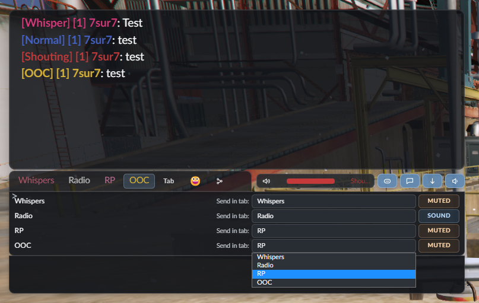

# PoodleChat (Reworked)

A modern chat resource for FiveM with channel tabs, whispers, voice-range integration, grouping, notifications, and emoji support.



## Why my PoodleChat fork

- Multi-channel chat (`local`, `global`, `staff`, `whispers`, custom)
- Per-player tab grouping with persistence
- Per-tab notification toggles + global notification control
- pma-voice range integration for labels and color mapping
- Typing indicators and chat bubbles
- Emoji panel with recent and top-used tracking
- Optional Discord webhook forwarding

## Requirements

- Optional: `pma-voice` (only needed if `voice.enabled = true`)

## Installation

1. Place `poodlechat` in your `resources` folder
2. Add this to `server.cfg`

```cfg
ensure poodlechat
```

3. Disable default chat

```cfg
# ensure chat
```

4. Configure `shared/config.lua`

## Config Overview

Top-level sections:

- `settings`
- `channels`
- `messages`
- `commands`
- `routing`
- `whispers`
- `tabs`
- `notifications`
- `voice`
- `access`
- `ui`
- `emoji`
- `features`
- `discord`
- `runtime`

### Voice Color Stops

You can define as many middle colors as needed between `colorMin` and `colorMax`.

```lua
voice = {
  enabled = true,
  resource = 'pma-voice',
  fallbackLocalDistance = 50.0,
  colors = {
    colorMin = '#2e85cc',
    intermediate = {'#f1c40f', '#e67e22', '#ff8c42'},
    colorMax = '#e74c3c'
  }
}
```

Alternative format is also supported:

```lua
colors = {
  colorMin = '#2e85cc',
  intermediate = {'#f1c40f'},
  intermediate2 = '#e67e22',
  intermediate3 = '#ff8c42',
  colorMax = '#e74c3c'
}
```

## Default Commands

- `/global`, `/g`
- `/say`
- `/me`
- `/staff`
- `/dm`, `/whisper`, `/w`, `/msg`
- `/reply`, `/r`
- `/clear`
- `/togglechat`
- `/toggleoverhead`
- `/toggletyping`
- `/togglebubbles`
- `/togglesound`, `/sound`
- `/report`
- `/mute`
- `/unmute`
- `/muted`
- `/nick`

## Exports

### Server

- `exports['poodlechat']:SendChannelMessage(target, payload)`
- `exports['poodlechat']:SendBubbleMessage(sourceId, text)`

`SendChannelMessage` supports:

- `target`: single id, table of ids, `nil`, or `-1`
- `payload.channel`
- `payload.label`
- `payload.text`
- `payload.args`
- `payload.color`
- `payload.template`
- `payload.templateId`
- `payload.multiline`
- `payload.metadata`

### Client

- `exports['poodlechat']:AddChannelMessage(payload)`
- `exports['poodlechat']:SetChannel(channelId)`

Behavior:

- Invalid or inaccessible channels resolve automatically
- Whisper fallback is respected when whisper tab is disabled
- `AddChannelMessage` returns `(true, resolvedChannelId)`
- `SetChannel` returns `(true, resolvedChannelId)`

## Notes

- Staff visibility and access depend on ACE permissions
- Notifications are per-tab and persist via KVP
- Grouping and sound preferences are per-player and persist via KVP

---

<sub>README generated using AI assistance</sub>
